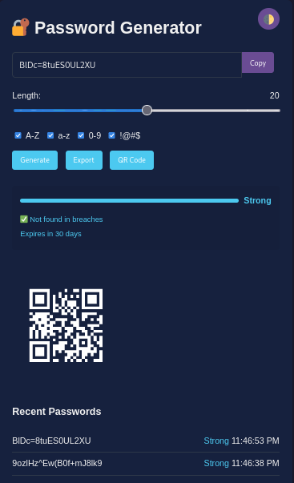

# 🔐 Secure Password Generator



A professional password generator with military-grade encryption, QR code sharing, and breach checking capabilities.

## ✨ Features

- **Secure Password Generation**
  - Custom length (8-32 characters)
  - Optional character sets (A-Z, a-z, 0-9, symbols)
  - Strength meter with color indicators
- **Security Tools**
  - SHA-256 hash display
  - HaveIBeenPwned breach checking
  - 30-day auto-expiry timer
- **Sharing Options**
  - Encrypted file export (AES-256)
  - QR code generation
- **Privacy Focused**
  - 100% client-side (no server communication)
  - Dark/light mode support
- **Password Management**
  - 5-item generation history
  - One-click password reuse

## 🚀 Installation

1. Clone the repository:
   ```bash
   git clone https://github.com/talhatariq708/Password-Generator.git

   Open index.html in any modern browser

   📜 Legal Use

This tool is intended for:

    Generating personal passwords

    Educational purposes

    Security research

Prohibited Uses:

    Illegal hacking attempts

    Generating passwords for unauthorized access

    Any malicious activities

🛠️ Technologies Used

    HTML5, CSS3, JavaScript

    Web Crypto API (AES-256 encryption)

    QRCode.js library

    HaveIBeenPwned API (breach checking)

📝 Changelog
v1.0.0 (Current)

    Initial release with core functionality

    Dark/light mode support

    Fixed expiry timer

👨‍💻 Developer

Talha Tariq

    GitHub: @talhatariq

    Email: talhatariq708@gmail.com